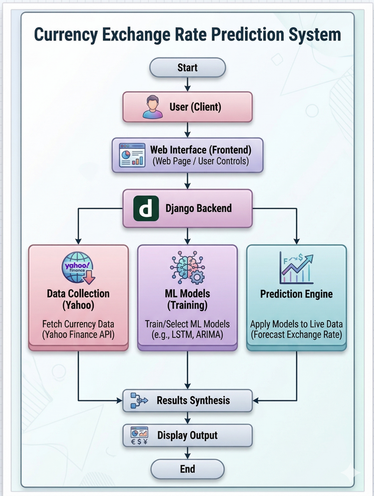

# Currency Exchange Rate Prediction using Machine Learning and Django


A machine learning-based web application that predicts currency exchange rates using Django and multiple ML models.

## Live Deployment
https://currency-exchange-rate-prediction-using.onrender.com

## GitHub Repository
https://github.com/ashrafmohammad7/Currency-Exchange-Rate-Prediction-using-Django

## Features
- Real-time currency exchange prediction
- Multiple ML model comparison
- Live Yahoo Finance data integration
- Interactive prediction charts
- Forecast table generation
- Django backend integration
- Responsive modern UI
- Deployment on Render

## System Architecture


## Key Highlights

- Real-time currency exchange forecasting
- Multiple ML model comparison system
- Interactive visualization dashboard
- Yahoo Finance live data integration
- Fully deployed Django application on Render
- Automated prediction workflow using Scikit-learn

## Tech Stack
Frontend:
- HTML
- CSS
- JavaScript
- Chart.js

Backend:
- Django
- Python

Machine Learning:
- Scikit-learn
- Pandas
- NumPy

Deployment:
- Render

Data Source:
- Yahoo Finance API

## Machine Learning Models Used
- Linear Regression
- Ridge Regression
- Random Forest Regressor
- Gradient Boosting Regressor

## Application Screenshots

## Application Dashboard


## Prediction Dashboard


## Forecast Analysis & Metrics


## Folder Structure

```text
Currency-Exchange-Rate-Prediction-using-Django/
│
├── api/
├── forexml/
│   ├── settings.py
│   ├── urls.py
│   └── wsgi.py
│
├── predictor/
│   ├── static/
│   ├── templates/
│   ├── views.py
│   └── urls.py
│
├── models/
│   └── Trained ML model files (.pkl)
│
├── train_model.py
├── data_fetcher.py
├── requirements.txt
├── build.sh
├── manage.py
└── README.md
```

## Installation & Setup Guide

Follow these steps to run the project locally on your system.

---

### Step 1: Clone the Repository

```bash
git clone https://github.com/ashrafmohammad7/Currency-Exchange-Rate-Prediction-using-Django.git
cd Currency-Exchange-Rate-Prediction-using-Django
```

---

### Step 2: Create Virtual Environment

```bash
python -m venv venv
```

---

### Step 3: Activate Virtual Environment

#### Windows

```bash
venv\Scripts\activate
```

#### Linux / macOS

```bash
source venv/bin/activate
```

---

### Step 4: Install Required Dependencies

```bash
pip install -r requirements.txt
```

---

### Step 5: Apply Database Migrations

```bash
python manage.py migrate
```

---

### Step 6: Train Machine Learning Models

```bash
python train_model.py
```

This step generates and stores trained ML models inside the `models/` directory.

---

### Step 7: Run the Django Development Server

```bash
python manage.py runserver
```

---

### Step 8: Open the Application

Open your browser and visit:

```bash
http://127.0.0.1:8000/
```

---

## Deployment

The project is successfully deployed on Render.

### Live Demo

https://currency-exchange-rate-prediction-using.onrender.com/

---


## How Prediction Works

1. User selects currency pair and ML model.
2. Django backend fetches real-time currency data from Yahoo Finance.
3. Selected ML model processes historical exchange data.
4. Model predicts future exchange rates.
5. Results are visualized using charts and forecast tables.
6. Multiple models are compared using evaluation metrics.

## Model Evaluation Metrics

The system evaluates machine learning models using multiple performance metrics to ensure accurate currency exchange rate forecasting.

| Metric | Description |
|--------|-------------|
| MAE (Mean Absolute Error) | Measures average prediction error magnitude |
| RMSE (Root Mean Squared Error) | Penalizes larger prediction errors |
| R² Score | Measures goodness of fit of the model |
| MAPE (Mean Absolute Percentage Error) | Calculates prediction accuracy percentage |

The application compares multiple ML models and automatically highlights the best-performing model based on prediction accuracy.


## Future Enhancements

- Deep Learning integration (LSTM)
- Real-time WebSocket updates
- Authentication system
- Portfolio analysis
- Currency trend alerts
- Mobile responsive dashboard

## Author
Mohammad Ashraf